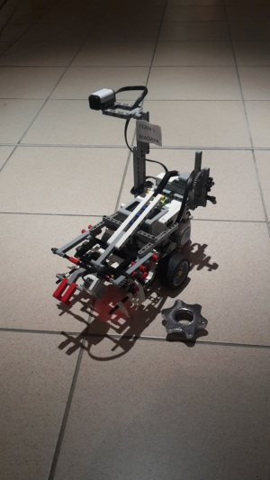

# Snake Game - Màdara

Màdara final version

**Màdara** is a robot designed for the Snake Game Competition organized as a project for the Operating Systems course at Eurecom. Refer to the official website at this [link](http://soc.eurecom.fr/OS/projects_fall2015.html) for the complete set of specifications.

## Contents

*   [1 Specifications summary](#Specifications_summary)
*   [2 Robot architecture](#Robot_architecture)
    *   [2.1 Sensors and actuators](#Sensors_and_actuators)
        *   [2.1.1 Encoders](#Encoders)
        *   [2.1.2 Ultrasonic Sensor](#Ultrasonic_Sensor)
        *   [2.1.3 Gyroscope](#Gyroscope)
        *   [2.1.4 Compass](#Compass)
        *   [2.1.5 Color Sensor](#Color_Sensor)
*   [3 Algorithms](#Algorithms)
    *   [3.1 Reference system](#Reference_system)
    *   [3.2 Basic functions](#Basic_functions)
        *   [3.2.1 Odometry](#Odometry)
        *   [3.2.2 Motor control](#Motor_control)
        *   [3.2.3 Gyroscope calibration and reading](#Gyroscope_calibration_and_reading)
        *   [3.2.4 Compass calibration and reading](#Compass_calibration_and_reading)
        *   [3.2.5 Controller based on encoders, gyroscope and compass](#Controller_based_on_encoders.2C_gyroscope_and_compass)
        *   [3.2.6 Ball detection and grab with check](#Ball_detection_and_grab_with_check)
        *   [3.2.7 Obstacle detection and avoidance](#Obstacle_detection_and_avoidance)
        *   [3.2.8 Go to position](#Go_to_position)
        *   [3.2.9 Blueetooth module](#Blueetooth_module)
    *   [3.3 Complex functionality](#Complex_functionality)
        *   [3.3.1 Main architecture](#Main_architecture)
        *   [3.3.2 FSM description of the overall behavior](#FSM_description_of_the_overall_behavior)
            *   [3.3.2.1 I am me](#I_am_me)
            *   [3.3.2.2 Leader](#Leader)
            *   [3.3.2.3 Follower](#Follower)
            *   [3.3.2.4 Go_back_home](#Go_back_home)
            *   [3.3.2.5 Get the ball](#Get_the_ball)
*   [4 Videos](#Videos)
    *   [4.1 Perfect square after compass calibration](#Perfect_square_after_compass_calibration)
    *   [4.2 Perfect 360° turn with the controller based on the gyroscope only.](#Perfect_360.C2.B0_turn_with_the_controller_based_on_the_gyroscope_only.)
    *   [4.3 Leader](#Leader_2)
    *   [4.4 Follower](#Follower_2)
    *   [4.5 Having fun with Wall_EV3](#Having_fun_with_Wall_EV3)
*   [5 How to work with EV3](#How_to_work_with_EV3)
    *   [5.1 Robot Setup](#Robot_Setup)
    *   [5.2 Source Code](#Source_Code)
    *   [5.3 Compile and Linking](#Compile_and_Linking)
    *   [5.4 Download and run the project](#Download_and_run_the_project)
*   [6 Work organization](#Work_organization)
*   [7 Work division](#Work_division)
*   [8 Team members](#Team_members)

### Specifications summary

A square arena contains some balls at predefined positions. A snake made of several robots communicating through a bluetooth server navigates in the arena led by the first robot. As soon as the first robot finds and grabs a ball, it comes back to the starting position and it passes the leadership to the following one. The robot has thus to cover two roles:

*   Leader: the robot navigates in the arena trying to find a ball, grab it, and bring it back to the starting area. During these operations he synchronizes with the following robots in order to make the entire snake move smoothly behind him;
*   Follower: the robot has to synchronize with the preceding and following robots in order to make the snake move correctly.

# Robot architecture

Building the robot

The choice of the robot architecture is a fundamental step in the design. The avalilable components are three motors with integrated encoders, an ultrasonic sensor, a compass, a gyroscope and a color sensor. A careful analysis of the specifications is necessary. First of all the basic functions that the robot must perform should be identified.

*   **Navigation and odometry**: the robot must be able to navigate in two different arenas delimited by two different kind of borders. At the moment of defining the architecture the exact arena configurtion is not yet completely known. The design must thus be very general and it must not relay on specific assumptions. Once the robot grabs the ball it must come back to the starting position. This means that at least when coming back the robot must have knowledge of his position. Since the robot communicates its movements to the following ones and must be able to follow the previous one based on this messages, it must be able to move of a predefined distance at a predefined speed in a given direction. For these reasons the best approach is to implement basic motion functions that allow to turn to an absolute angle and move straightforward keeping track of the current position in the arena through simple odometry techniques. The classic configuration for this kind of robots is a structure with two wheels controlled by two motors and a third auto-pivoting. To simplify odometry computations the only allowed operations are rotation and translation but not rototranslation. In other words the two wheels can turn only at the same or opposite speed. The motors provided already include encoders for feedback and the library already includes controllers to keep predefined speeds and turn of given angles. While the encoders precision and the PID controllers performace are sufficient for running forward, gyroscope and compass sensors are necessary to properly turn. Calibration and a custom controller are necessary. The gyroscope measures turning speed, the device performs integration to provide a relative angle value. It is very precise but is suffers from drift over time and vibrations during the turn. It is placed near the robot center, in a very stable position. Since it is mechanical (MEMS) it does not suffer from electromagnetic noise. The compass is instead much sensitive to noise from the brick and from the motors and actuators so it must be placed as far as possible from them on the top of the robot. Care must be taken in keeping it stable and well aligned.
*   **Ball and obstacle detection**: during navigation the robot must be able to detect objects. The only available sensor is the ultrasonic one. Unfortunately its range and directivity are quite bad for this task. It is very important to properly place it in the front of the robort, at ball height, horizontally. Calibration and a proper algorithm allow to detect and find a ball. Wall and obstacles can be distinguished from balls exploiting the robot knowledge of his position and its role. However, to improve this feature a color sensor is added on the arm. This also allows to check if the ball was actually grabbed or if the operation failed.
*   **Ball grabbing**: the robot stops when the sensor is in front of the ball, so the arm must be in front of the sensor. However if the ball is just grabbed, the sensor cannot be used to detect obstacles anymore. Since obstacles are more likely to be present while going back home (other robots in the snake or other balls) this is very bad. For this reason an arm able to lift the ball after having grabbed it is designed. Since only one actuator is available for the arm, the complex dual step movement must be implemented mechanically as shown in the figures.
*   **Communication**: to easily communicate with the robot during development and additional wifi module is added. This also allows to communicate with a custom server to simulate several steps of the game for debugging.

## Sensors and actuators

A complete (as far as required) specification of the sensors can be found at this [link](http://www.ev3dev.org/docs/sensors/).

### Encoders

They are used for the motors, so it is possible to specify the type of movement, such as example turn absolute that is used for the arm, or turn relative that is useful for the movement of the wheels. The returned value is the number of turns degree of the motor and is expressed in tachometers. To convert these values into real ones we used some conversion functions, for example for the wheel's motors we taking into account the size of the wheels. We also use the encoders to know the actual position but when the wheel slip the robot thinks to be in a position but in the reality it is in another one.

### Ultrasonic Sensor

This sensor works issuing sound waves that if reach an object are reflected and come back to the sensor. It give us values that are time intervals, in which the waves return to sensor, so we use a formula to transform time into distance. They are influenced by a lot of factors like distance from the floor, presence of other sensors that works on the same frequency and the angle of reflection. For these reasons it sometimes gives false positives.

### Gyroscope

This sensor measures the angular speed of rotation around an axis and, consequently, the angle of rotation on that axis. It has different modes of work and can return values such the angle of rotation and the rotation speed. For our project we use this sensor with the compass in order to obtain better performances. The main weakness is that it is a mechanical sensor so it is influenced by the temperature, since the metal parts suffer from thermal expansion. For this reason it piles up errors that may derive the real measure.

### Compass

This sensor allow us to do absolute rotations since it returns a value in degrees that indicates the angle respect the north, that for little distances is always the same. In this way we avoid the problem of sum errors at every measurement. Before use it we have to calibrate it in different strategic places inside the arena in order to obtain an optimal result. The problem of this sensor is that it suffers from electromagnetic fields which compromise the measures, then sometimes it's very difficult to use it into labs in which there are a lot of electronic devices. Outside Eurecom we never had these problems, while we have them in the little arena.

### Color Sensor

This sensor works using a light beam and has different modes of working. We use it in the colour mode, where it returns an integer that indicates a specific colour (1 Black, 2 Blue, 3 Green...and so on). In our case we discovered that it has problems to detect the colour blue, moreover it detects colours only at very little distances.

<iframe src="https://www.youtube.com/embed/0klZ_4R96o8" allowfullscreen="" frameborder="0" height="170" width="300"></iframe>

Arm: grab and lift the ball

# Algorithms

## Reference system

The following reference system is considered by the robot:

*   the bottom left angle is the origin of the cartesian system that has axis y along the left border oriented to up and the x axis along the bottom border oriented to right.
*   the reference 0 angle is along the y axis. The angle increase clockwise.

## Basic functions

### Odometry

In each of the following functions the robot knows its position (x,y,t) in the previously described reference system. Each time the robot moves of a certain distance d in a given angle w, at the end of the movement its position is updated according to the following simple relations:

<pre> x += d*sin(w*PI/180)
 y += d*sin(w*PI/180)
 t = w
</pre>

If the robot is in a given postition x,y and wants to reach a destination X,Y it must compute the angle and distance that it has to cover according to these simple relations:

Usually the position is updated on the basis of the target one since this gives the best accuracy. However if the robot stops in the middle of a movement due to an obstacle or cancel message, the actual distance is measured with the encoders.

### Motor control

Some predefined controllers available in the library that exploit the encoders can be used. As far as the arm is concerned a predefided function that makes the motor turn of an absolute angle is used. Each time the robot is turned on with the arm down this angle becomes the zero reference for the encoder control. The grab position can be reached turning of a precomputed absolute angle. When the arm reaches one of the positions, a [PID controller](https://en.wikipedia.org/wiki/PID_controller) is started in order to keep that position. Two functions called grab_and_check and drop_the_ball are incluede in the lib/ev3lib_ball library. They are blocking. To go straight for a certain distance at a certain speed one PID controller for each motor is started giving a reference speed (computed with a simple mapping from speed in cm/s to tachocounts/s). The motors stop after having turned for a given number of counts, computed with a simple mapping between cm and counts (considering the diameter of the wheels). When the final position is reached, a PID controller is set to keep it. If the speed to reach is quite high, a step command is not suitable. In fact it makes the wheel slip on the floor loosing precision. For this reason the possibility of using ramp commands is included. A run_relative(cm) function is included in the lib/ev3lib_motor library. It is a non-blocking function. A flag must be checked to see when it finishes. This allows to poll/check also other conditions. For instance it is possible to look for the presence of an obstacle while running. This function is properly called by higher-level ones and never directly in the main application. To turn of a given angle the two motors are given a command to turn of a relative angle simply computed taking into account the wheel diameter and the distance between them. Again a PID is started to keep the final position. A turn_relative(angle) function is included in the lib/ev3lib_motor library. Encoders do not provide a good accuracy for this turn. This function is never called directly in the main application, but it is called by higher-level functions that also handle gyroscope and compass values.

### Gyroscope calibration and reading

The device is able to integrate its measurements to compute an absolute angle that can be read. At initialization the zero position is calibrated so that each value is given in the chosen reference system.

### Compass calibration and reading

The compass provides an absolute measurement of the angle w.r.t. to the north. Since the distances inside the arenas are quite short, this value is condidered to be constant. The values read from the compass are quite stable and don't reaquire any additional filtering. However the magnetic field is strongly influenced by external sources, so the values change in different positions of the arena. Moreover in a given position the results are not linear. To solve this problem multiple calibrations can be performed. A simple goniometer is used as reference to calibrate 8 angle values in 4 different positions of the arena. These 32 values are stored into a file that is loaded into memory at run time. Given a certain angle it is possible to retrieve the corresponding measurement value of the nearest calibrated angle. The choice of the calibration point is based on the x,y position in the arena, selecting the nearest one. This mechanism is exploited by the function responsible for absolute turns. The main goal is to have in each position a good absolute angular reference. This solves the drift problem from which the gyroscope is affected. It is possible to reach a calibration angle known with high accuracy and then turn relatively of a small angle exploiting the gyroscope that does not suffer from drift if the time between two measurements is small. The encoders as well are good for small turns starting from a known position. As for the gyroscope the zero position is calibrated at the beginning by saving the arena heading and then subrating it from each reading. The calibration functions are part of the library lib/ev3lib_motor_controller. The program **calibration** calls it providing a nice user-friendly interface for calibrating the compass in one position and saving the points to file. A complete file for all positions can be then easily created editing the different files created even independently. It is very important to calibrate the compass before each competetion, especially if the position of the arena changes. This feature allows great accuracy in the movements, however it is also very critical for the performace and must be performed with much care.

### Controller based on encoders, gyroscope and compass

The best approch is to build a filter between the angle values that can be retrieved from the encoders, the gyroscope and the compass. For instance a Karman filter. This allows to compute a value of the current angle with low uncertainty and then build a controller based on this measure for the feedback. Due to the complexity of this filter and since the focus of the course is Operating Systems and not control theory, measurements and odometry, this approach is discarded and a more naive, though effective one is chosen. The main idea is to exploit the PID controllers based on the encoders to handle the dynamic behaviour of the system in a nice way and on top of it use the values of the gyroscope and compass to increase the accuracy. In other words the turn relative function based on the PID can be used to turn of a given angle and the PID is able to handle the dynamic behaviour of the robot providing a smooth response. A proportional controller computes the error between target and current angle using the gyroscope and then gives the command (divided by a constant of 4) to the turn relative function. Since the internal meachanism already handles the dynamic behavior, the proportional controller is sufficient it is a way to use the gyroscope better precision. This is the turn relative function included in the lib/ev3lib_motor library. On top of it, similary, a turn absolute function is built. It used a proportional controller and the calibrated compass values as well as the compass reading to reach the calibrated angle nearest to the reference one. The it calls the simple turn relative to make the remaining movement. This way the even better accuracy of the calibrated angles is exploited. In the end the result is very good and it does not drifts during the competition. The video section shows how the robot can turn perfectly of a given angle. Figure _contoller_ shows a diagram of the overall system. Follows the pseudocode of a proportional controller that once the final position is reached exits.

<pre> while((error = reference - actual < margin) ){
   command = k*error;
 }
</pre>

Even if the proportional controller exits, sice the command is given to the PID controller, the final position is kept in hold.

### Ball detection and grab with check

This basic function is called whenever the robot reaches a position where he thinks there is a ball, either because he reached a predefined position or because he encountered something during his movements. The main idea is to perform a scan in two directions trying to identify the angle at which the minimum distance from the object is found. To avoid considering walls as balls, a limit on the distance is set. If the distance is greater than this limit it is considered as infinity. Since the robot never goes near the wall at a distance smaller than the limit, the wall is never considered in the minimum computation even if it seen by the sensor. This procedure is repeated several times, after each scan the robot tunrs to the position of the minimum and then approaches the ball running for 3/4 of the distance from it and then scans again. If during the following scan the minimum is not found, the robot tries a second time before saying the ball is not there. Once the distance from the ball is less than a certain limit the robot tries to grab it and then checks the color sensor to see if the grab was successful. In case of failure it tries againg to scan and grab twice before saying the ball was not found. This strategy is very slow but really effective since the successive approximations allow the robot to grab the ball even if it was not really aligned to it when it stopped the first time and even if some errors occur due to imprecisions during the scans or if the ball is lost during grab.

### Obstacle detection and avoidance

To detect obstacles it is simply sufficient to check the distance values of the ultrasonic sensor while running. A limit is set that allows the robot to stop before touching it. In case the obstacle is after the final destination point movement can be completed. Otherwise some action is perfomed based on the main strategy described in the following sections. The distance covered before the abort due to the obstacle is measured thanks to the encoders. After an obstacle is found the action to take depends on the main strategy described in the following secions. In case it is necessary to avoid the obstacle an obstacle avoid function is called. This simply decides to turn left or right of 45 degrees depending on the robot position and angle in the arena. Then it makes the robot run for 40 cm. This decision is made thanks to a look-up in a 3D matrix of hardwired values wich takes as input i,j,k where i is 1 if the robot is in the right part of the arena, y if it is in the top part, and k can take values from 0 to 3 according to the quadrant in which the robot angle is.

### Go to position

To run forward of a given distance at a given speed the proper command is given to the motors using set_motors_speed and run_relative with a proper mapping between distance and angles. Once the command is given, the motors and sensors act as devices in parallel with the main application. The main application polls the status flag in the motors to see when the movement is completed. This basic functionality can be improved also checking the value of the distance given by the ultrasonic sensor (to detect an obstacle) and the value of the flag that indicates the reception of a cancel message. The basic go to position function exits whenever the final position is reached or a cancel message is received or an obstacle is found and returns this status (as well as updating the robot posistion). Actually, to be more precise, when an object is detected, if its position is after the final destination the movement is re-started and completed and the final exit value is reached. This function also allows to specify a margin to use when reaching the final destination. For instace it is possible to reach a position 40 cm before the position of the next robot given as input. If a movement is bigger than 200 cm it is split in several 200cm ones plus the remainder, in order to avoid sending distance messages bigger than 255cm and also to re-calibrate the angle at each step. This function can be used as it is, for instance in the leader where the only exit conditions are reached and obstacle and in both cases the action to take is to try to grab a ball. This function is then used by a more complex one that implements (if set as parameter) obstacle avoidance. Follows the pseudo code in a very simplified form:

<pre>go_to_pos_int(pos){
  while( (r = goto(pos)) != reached ){
    if(r == obstacle) avoid()
    elsif(r == cancel) break;
  }
}
</pre>

Avoid obstacle is a function that implements the strategy described in the avoid obstacle section.

### Blueetooth module

The bluetooth communication is handled as shown in the picture. Everything is managed inside library. The init function creates a socket and then spawns a thread. This thread executes a blocking read on the input buffer, whenever a message is available it calls the correspondig callback function that was registered during initialization. These callbacks can be used to execute operations driven by the message events. It is important to notice that when a callback is being executed the socket buffers incoming messages that are therefore not lost, however the scheduler that reads from the buffer and schedules callback is blocked. This means that the next message will be served only after the completion of the previous callback. It is thus necessary to write very short callbacks, for instance just to set variables in order to synchronize operations in the main application. Send functions with the message name can be invoked from the main application to send messages to the output buffer whenever required.

## Complex functionality

### Main architecture

The program is basically composed by two parts. The first one is the bluetooth thread that acts as scheduler for the message callbacks. The second one is the main that acts a scheduler for the follower, leader and go_back_home functions. The main and the bluetooth threads synchonize thanks to the callbacks that set/unset lock variables. For instance the main waits polling a flag that is set by a callback. This busy-wainting approach is not the best one at all since the waiting thread has to be continuously scheduled to perform the check. It would be better to use a mutex and a condition variable or a semaphore to make the waiting thread sleep while the flag is not set. Moreover the robot has to interpret the sensors to interpret them as events, like obstacle detection.

### FSM description of the overall behavior

The functionality implemented by the robot is very complex and can be easily modeled as a finite state machine that reacts to events such as messages and detection of obstacles. Pseudo-code is not as suitable as an FSM for this description. Since this FSM would be extremely big, it is better to use hierarchy. First a high-level description of the idle,leader,follower,go_back_home,exit behavior is provided. Then each of these states is described itself as an FSM.

#### I am me

#### Leader

The main strategy used by the leader is described in the following.
The robot first reads a file of predefined positions to reach and it follows the path (even several times) until a ball is found. Since a ball is likely to be present in each predefined position, the success is very probable. Thanks to the object detection feature, if a ball is found in an area around this path, it is detected and grabbed. Since the path is properly designed to cover most of the arena, also balls at random positions (or moved from predefined positions) can be grabbed.
Tests show how efficient this algorithm is in several conditions. See the video section for several cases.

#### Follower

The most important part of the follower algorith is the choice of the position where to go based on the action (or cancel) message received. The distance to keep from the other robot is 40 cm (center to center). In case the preceding robot moves of a distance greater than 40 cm, the robot first reaches the past position of the preceding one, than it moves towards its new position (computed thanks to the action message), but it stops 40 cm before (thanks to the margin paramenter in the go_to function). If the distance is less than 40 cm this algorithm does not work. For this reason the robot first aligns itself on the line that links its position to the new position of the preceding robot. Then it moves forward or backward in order to keep a 40 cm distance from the new position.
After having received an action message the robot waits some time before starting to move and the motion itself takes time (especially to turn). If a cancel message is received, the robot stops, but at this time it is not necessary at 40 cm from the preceding due to the differences in the beginning of the movement. So an **additional feature** of the cancel message is exploited to resychronize: if the robot that sends the cancel implements the distance field, this piece of information is exploited to compute where it actually stopped and complete the 'follow action' using that target instead of just aborting the movement. Madara also implements this distance feature when it has to send a cancel message.
This algorithm proved to be very efficient during tests with team Wall_EV3.

#### Go back home

The main strategy to go back to the starting position is just to use the go_to function, exploiting its object avoidance features in case other obstacles are in the middle.

#### Get the ball

Here a flow chart is the better approach to explain functionality also described in the basic functionality section.

# Videos

## Perfect square after compass calibration

The video shows how Madara performs a perfect tour around the arena after the compass calibration in four corners. It is possible to see how after the calibration Madara is able to rotate perfectly in the direction of the cardinal compass points.
<iframe src="https://www.youtube.com/embed/XRQKZBUhkXI" allowfullscreen="" frameborder="0" height="150" width="300"></iframe>

## Perfect 360° turn with the controller based on the gyroscope only.

This video shows how the controller makes the robot perfectly turn of a given angle.
<iframe src="https://www.youtube.com/embed/5aH2H0Zv7NE" allowfullscreen="" frameborder="0" height="150" width="300"></iframe><iframe src="https://www.youtube.com/embed/Jz68CfKGg8w" allowfullscreen="" frameborder="0" height="150" width="300"></iframe>

## Leader

The video shows how Madara is able to reach a predefine position in the arena, search for a ball, take the ball and come back home avoiding obstacles along the path. Notice that the border of the arena is not considered as an obstacle
<iframe src="https://www.youtube.com/embed/dcuA6EKFThM" allowfullscreen="" frameborder="0" height="300" width="600"></iframe>
<iframe src="https://www.youtube.com/embed/JgM385DASXQ" allowfullscreen="" frameborder="0" height="300" width="600"></iframe>
This video shows how Madara is able to grab the second ball since the one in the first position is not there.
<iframe src="https://www.youtube.com/embed/KqzU1qcnCDc" allowfullscreen="" frameborder="0" height="300" width="600"></iframe>
This video shows a leader-follower test before the first deadline, when obstacle avoidance was not yet implemented.

<iframe src="https://www.youtube.com/embed/-jWaK5a4L84" allowfullscreen="" frameborder="0" height="170" width="300"></iframe>

Leader mode

## Follower

The video shows how Madara is able to follow a leader until it receives a cancel messages.
<iframe src="https://www.youtube.com/embed/TOAfITM8c0c" allowfullscreen="" frameborder="0" height="300" width="600"></iframe>

## Having fun with Wall_EV3

This video shows some tests with another robot.
<iframe src="https://www.youtube.com/embed/SkIcUy5U4SY" allowfullscreen="" frameborder="0" height="300" width="600"></iframe>

# How to work with EV3

## Robot Setup

First of all we need to install the Operating System on the EV3 robot. This operation can be performed through these steps:

1.  Download the image of _Debian for EV3_: we download the image from this [link](https://github.com/ev3dev/ev3dev/releases/download/ev3-ev3dev-jessie-2015-09-13/ev3-ev3dev-jessie-2015-09-13.img.zip) but you can find all the aviable version at this [link](https://github.com/ev3dev/ev3dev/releases);
2.  Copy the image file on SD card: this is not only a simple copy and paste but the image just donloaded represent the final state of the SD card. We copy the content of the image byte by byte in a row way. This copy overwrite the file system of SD and this operation will delete the SD card content. To do that we use Win32DiskImager on Windows;
3.  Finally we insert the SD into EV3 and then we turn it on. The first boot takes a little longer than next boots.

At this point we have a robot with a working Debian OS able to read sensors and send command to actuators. The next step is to enstablish a connection with our PC in order to load and write programs and better configure the robot.
For the connection we use a USB WiFi module plugged directly in the robot USB port in order to connect it to a WiFi network generated by our PCs. We use this type of connection because it allow us to connect more then one PC to the robot at the same time and to work without cables.

Before we start to write code we perform some initial setup:

1.  Change the root password (for security porpouses);
2.  Create a new user without root privileges: it is needed to execute our program by typing on the roboot user interface;
3.  Download lastest debian updates;

## Source Code

The source code of our project is split into multiple source files:

*   _bt_main7.c_ containing the main function that implements the strategy for the game
*   _calibrate.c_ implementing an interface with the user to perform the compass calibration
*   several source files and their relative header files ( also called libraries) stored in the folder lib that provide primitives for the sensors and functions that are used several time in the main code.

To go deeper into details, the lib folder contains:

*   _ev3lib_ball.c/.h_ : functions to find and grab the ball
*   _ev3lib_bluetooth.c/.h_ : functions to implement the bluetooth protocol
*   _ev3lib_gui.c/.h_ : functions to display errors on the robot and turn on the led
*   _ev3lib_motor.c/.h_ : motor primitives
*   _ev3lib_motor_controller.c/.h_ : functions to improve motor primitives by implementing PID controller
*   _ev3lib_sensor.c/.h_ : sensor primitives

Exsternal libraries used:

*   [ev3dev-c](https://github.com/in4lio/ev3dev-c) written by @in4lio
*   [ev3c](https://github.com/theZiz/ev3c) written by @theZiz

## Compile and Linking

In order to compile and link our project we use a Makefile. The Makefile creates a tree of dependencies of the main program then, only the first time, it compiles all the libraries in order to create the obj files and finally it links all the obj file in order to obtain the final executable. The Makefile is written is such a way the first time we have to compile all the libraries and then we have to compile only the library that we modify, in this way we save time. To compile the main program you simply have to run:

<pre> $ make
</pre>

Otherwise, if you want to compile another program that uses the library written by us you have to run:

<pre> $ make EXEC=program_name
</pre>

This method does not work so well when you have to remove the battery due to a system crash, in fact after this operation the internal clock is reset and the make file generates an error called "Clock skew detected". In order to solve this problem you simply have to recompile the whole project.

## Download and run the project

After one has connected the laptop on the same Wi-fi network of the robot, it is possible to load the source code on the robot using the _scp_ command.

It is possible to download the source code from the following links:

*   [link](project_sources/Madara_home.zip) : this compressed file have to be extracted in the home folder
*   [link](project_sources/Madara_usr_local_bin.zip) : this compressed file have to be extracted in the usr/local/bin folder

Before compiling the project one has to set the bluetooth address of the server by editing the define SERVER_ADDRESS inside the file lib/ev3lib_bluetooth.h

At this point, run the following command from the project folder in order to compile it:

<pre> $ make
</pre>

Finally, after the bluetooth server start, run the main program:

<pre> $ ./bt_main7
</pre>

# Work organization

The team has worked on this project constantly from mid November to the final competion on the 18th of January. Considering no less than 15 hours per week for 8 weeks we estimate around 120 hours of work.
By the 14th of December (first deadline) the robot was already complete in its current architecture and able to perform all main tasks. However the compass was not yet well calibrated in several arena locations and obstacle avoid function had not been implemented. During the development of the obstacle avoid function the necessity of a custom cancel message to add to the specification arised. This feature was implemented and tested with team Wall_EV3\. Moreover random ball search was improved exploiting the obstacle detection (before the robot had to stop at random points and start a scan for ball, now scan for ball can be triggered by an obstacle detection). The color sensor to check if the ball was really grabbed was added to.

The development procedure includes a brainstorming session after personal reflection, followed by implementation in pairs or trios. Debugging is made by the same sub-team and then by the one who did not write the code, in order to split writing and verification and improve the efficiency. The code is revised and rewritten cleanly by someone who did not write it and again it is tested by someone else. This allows to easily find and solve bugs.
Moreover collaboration with team Wall_Ev3 allowed to test and improve the communication features between robots.

# Work division

Here follows the list of the most important parts of the main along with the person/people who has/have worked on the main writing stage.

* **Wrapper of basic functionalities** -> Giovanni Camurati; Marco Lucarella;
* **Sensors calibration** -> Giovanni Camurati; Enrico Gioia;
* **Bluetooth communication** -> Marco Lucarella; Simone Marchisio;
* **Leader strategy** -> Enrico Gioia;
* **Follower strategy** -> Simone Marchisio;
* **Scan for ball** -> All members
* **Grab the ball** -> All members
* **Check ball grabbed** -> Marco Lucarella; Simone Marchisio;
* **Go to position x, y** -> Giovanni Camurati; Enrico Gioia;
* **Turn absolute using compass** -> Giovanni Camurati;
* **Turn relative using gyroscope** -> Giovanni Camurati; Enrico Gioia;
* **Avoid obstacle** -> Marco Lucarella; Enrico Gioia; Simone Marchisio;
* **Compilation** -> Marco Lucarella;
* **Web site** -> All members

# Team members

* **Marco Lucarella**
* **Enrico Gioia**
* **Giovanni Camurati**
* **Simone Marchisio**
